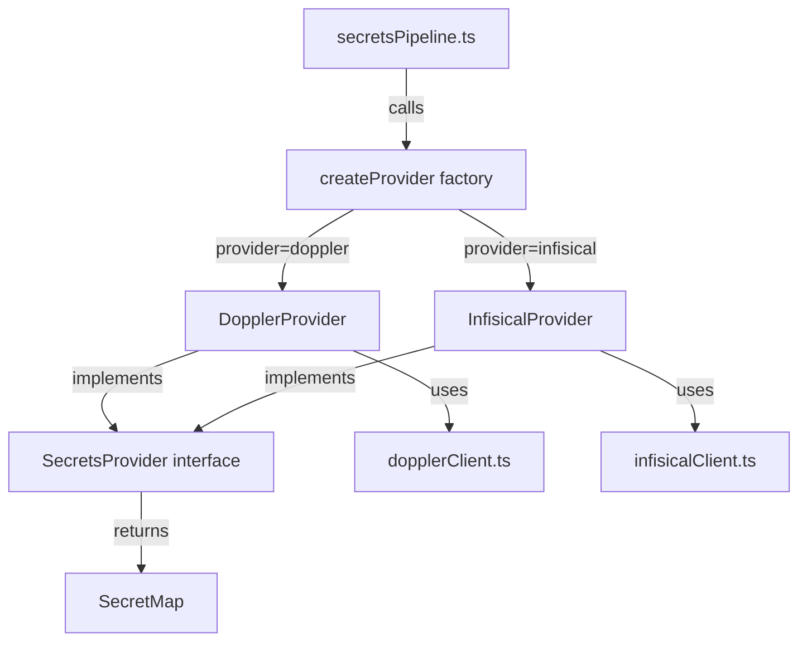
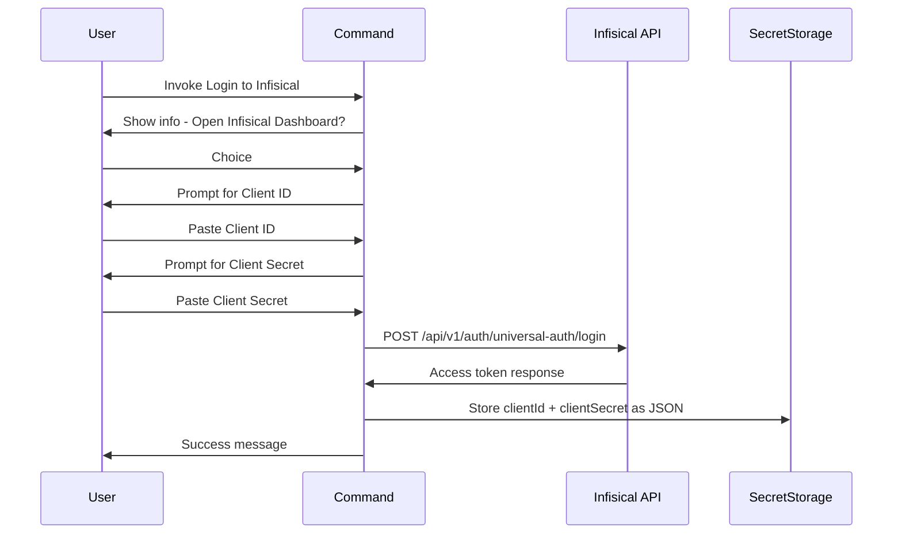

# Infisical Provider — Design Document

## 1. Overview

This document describes the design for adding **Infisical** as a second secrets provider alongside the existing Doppler integration in the Dev Setup VS Code extension. The design introduces a provider abstraction layer so that both Doppler and Infisical — and any future providers — share a common interface.

### Goals

- Abstract secrets fetching behind a `SecretsProvider` interface
- Add Infisical as a provider with full self-hosting support
- Support provider-specific parameters (e.g., custom API base URL) in config
- Maintain 100% backward compatibility with existing Doppler-only configs
- Follow existing project conventions (named exports, JSDoc, `async/await`, etc.)

---

## 2. Architecture Overview



---

## 3. Provider Interface

A new file [`src/providers/providerTypes.ts`](src/providers/providerTypes.ts) defines the common interface.

```typescript
import * as vscode from 'vscode';
import { SecretMap } from '../config/configTypes';

/** Options passed to every provider method. */
export interface ProviderContext {
    secrets: vscode.SecretStorage;
    outputChannel: vscode.OutputChannel;
}

/**
 * Common interface that every secrets provider must implement.
 * Each provider knows how to authenticate, fetch secrets,
 * and manage its stored credentials.
 */
export interface SecretsProvider {
    /** Human-readable name shown in UI messages (e.g. 'Doppler', 'Infisical'). */
    readonly displayName: string;

    /** Unique code name matching the config `provider` field (e.g. 'doppler', 'infisical'). */
    readonly id: string;

    /**
     * Retrieve the stored authentication token/credential.
     * Returns `undefined` when no credential is stored.
     */
    getStoredToken(ctx: ProviderContext): Promise<string | undefined>;

    /**
     * Fetch secrets for a given project and config/environment batch.
     *
     * @param token      - The authentication token (already retrieved)
     * @param project    - The project identifier (Doppler project slug, Infisical workspace ID)
     * @param config     - The config/environment name (Doppler config name, Infisical environment slug)
     * @param ctx        - Provider context with output channel
     * @param providerParams - Optional provider-specific parameters from config
     * @returns A flat map of secret names to their string values
     */
    fetchSecrets(
        token: string,
        project: string,
        config: string,
        ctx: ProviderContext,
        providerParams?: Record<string, unknown>,
    ): Promise<SecretMap>;
}
```

### Why this shape?

| Decision | Rationale |
|----------|-----------|
| `getStoredToken` on the provider | Each provider stores its credential under a different `SecretStorage` key. The provider owns its key name. |
| `providerParams` on `fetchSecrets` | Infisical needs a `baseUrl` and optional `secretPath`; Doppler ignores this parameter. Adding it as an optional bag keeps the interface generic. |
| Separate `displayName` / `id` | `displayName` is for user-facing messages; `id` is the machine-readable key used in config files. |
| No `login` on the interface | Login flows are VS Code commands with provider-specific UX — they register independently and are not called through the pipeline. |

---

## 4. Provider Factory

A new file [`src/providers/providerFactory.ts`](src/providers/providerFactory.ts) exports a factory function.

```typescript
import { SecretsProvider } from './providerTypes';
import { DopplerProvider } from '../doppler/dopplerProvider';
import { InfisicalProvider } from '../infisical/infisicalProvider';

const PROVIDER_REGISTRY: Record<string, () => SecretsProvider> = {
    doppler: () => new DopplerProvider(),
    infisical: () => new InfisicalProvider(),
};

/**
 * Create a SecretsProvider instance for the given provider id.
 * Throws if the provider is unknown.
 */
export function createProvider(providerId: string): SecretsProvider {
    const factory = PROVIDER_REGISTRY[providerId];
    if (!factory) {
        throw new Error(
            `Unknown secrets provider: "${providerId}". ` +
            `Supported providers: ${Object.keys(PROVIDER_REGISTRY).join(', ')}`,
        );
    }
    return factory();
}
```

The registry is a plain object so new providers can be added with a single line.

---

## 5. Config Type Changes

### 5.1 Updated [`SecretsConfig`](src/config/configTypes.ts:9)

```typescript
export interface SecretsConfig {
    provider: string;
    /** Loader to use for writing secrets (e.g. 'dotenv'). Optional if `script` is defined. */
    loader?: string;
    /** Shell command to run in a VS Code terminal with secrets injected as env vars. */
    script?: string;
    batches: string[];
    project?: string;
    /** Optional filter object with include/exclude regex patterns for secret keys. */
    filter?: SecretFilter;
    /**
     * Provider-specific parameters. Each provider defines which keys it recognises.
     * Unknown keys are ignored.
     *
     * Doppler: (none currently)
     * Infisical: { baseUrl?: string; secretPath?: string }
     */
    providerParams?: Record<string, unknown>;
}
```

### 5.2 Infisical-specific `providerParams`

| Key | Type | Required | Default | Description |
|-----|------|----------|---------|-------------|
| `baseUrl` | `string` | No | `https://app.infisical.com` | Base URL for self-hosted Infisical instances |
| `secretPath` | `string` | No | `"/"` | Folder path for secrets within the environment |

### 5.3 Example YAML configs

**Doppler (unchanged — backward compatible):**

```yaml
secrets:
  provider: doppler
  loader: dotenv
  batches:
    - dev
```

**Infisical with defaults (Infisical Cloud):**

```yaml
secrets:
  provider: infisical
  loader: dotenv
  project: "64abc123def456..."   # Infisical workspace ID
  batches:
    - dev                         # environment slug
```

**Infisical self-hosted with custom path:**

```yaml
secrets:
  provider: infisical
  loader: dotenv
  project: "64abc123def456..."
  batches:
    - dev
  providerParams:
    baseUrl: "https://secrets.mycompany.com"
    secretPath: "/backend"
```

### 5.4 Backward Compatibility

- The `provider` field is already required and validated as a non-empty string.
- Existing configs with `provider: doppler` continue to work — [`providerParams`](src/config/configTypes.ts) is optional and Doppler ignores it.
- The pipeline currently hard-checks `provider !== 'doppler'`; this will be replaced by the factory lookup.

### 5.5 Config Parser Changes

[`configParser.ts`](src/config/configParser.ts) needs validation for the new `providerParams` field:

- If present, it must be a plain object (not an array, not null).
- No further deep validation — each provider validates its own params at fetch time.

---

## 6. Infisical API Details

### 6.1 Authentication Flow — Universal Auth

Infisical uses **Machine Identity Universal Auth**. The user provides a **Client ID** and **Client Secret** pair.

**Step 1 — Login to get an access token:**

```
POST {baseUrl}/api/v1/auth/universal-auth/login
Content-Type: application/json

{
  "clientId": "<machine-identity-client-id>",
  "clientSecret": "<machine-identity-client-secret>"
}
```

**Response:**

```json
{
  "accessToken": "eyJhbG...",
  "expiresIn": 7200,
  "accessTokenMaxTTL": 86400,
  "tokenType": "Bearer"
}
```

**Step 2 — Fetch secrets:**

```
GET {baseUrl}/api/v3/secrets/raw?workspaceId={workspaceId}&environment={environment}&secretPath={secretPath}
Authorization: Bearer {accessToken}
```

**Response:**

```json
{
  "secrets": [
    {
      "id": "...",
      "key": "DATABASE_URL",
      "value": "postgres://...",
      "type": "shared",
      "environment": "dev",
      ...
    }
  ]
}
```

### 6.2 Mapping to Provider Interface

| Provider Interface Concept | Infisical Equivalent |
|---------------------------|---------------------|
| `token` (from `getStoredToken`) | JSON string containing `clientId` + `clientSecret` |
| `project` parameter | `workspaceId` query param |
| `config` parameter (batch) | `environment` query param |
| `providerParams.baseUrl` | API base URL (default: `https://app.infisical.com`) |
| `providerParams.secretPath` | `secretPath` query param (default: `"/"`) |

### 6.3 Token Storage Format

Since Infisical requires **two** credentials (clientId + clientSecret), the stored secret in `SecretStorage` will be a JSON string:

```json
{
  "clientId": "...",
  "clientSecret": "..."
}
```

Secret storage key: `dev-setup.infisicalCredentials`

---

## 7. Infisical Client Implementation

New file: [`src/infisical/infisicalClient.ts`](src/infisical/infisicalClient.ts)

```typescript
import * as vscode from 'vscode';
import { SecretMap } from '../config/configTypes';

const DEFAULT_INFISICAL_API_BASE = 'https://app.infisical.com';
const SECRET_KEY = 'dev-setup.infisicalCredentials';
const FETCH_TIMEOUT_MS = 30_000;

export interface InfisicalCredentials {
    clientId: string;
    clientSecret: string;
}

export interface InfisicalAccessToken {
    accessToken: string;
    expiresIn: number;
    tokenType: string;
}

/**
 * Parse stored credential JSON into an InfisicalCredentials object.
 * Throws if the JSON is malformed or missing required fields.
 */
export function parseCredentials(raw: string): InfisicalCredentials { ... }

/**
 * Store Infisical credentials in VS Code SecretStorage as JSON.
 */
export async function storeCredentials(
    secrets: vscode.SecretStorage,
    credentials: InfisicalCredentials,
): Promise<void> { ... }

/**
 * Retrieve Infisical credentials from VS Code SecretStorage.
 */
export async function getStoredCredentials(
    secrets: vscode.SecretStorage,
): Promise<string | undefined> { ... }

/**
 * Authenticate with Infisical Universal Auth and return an access token.
 */
export async function authenticate(
    credentials: InfisicalCredentials,
    baseUrl: string,
    outputChannel: vscode.OutputChannel,
): Promise<InfisicalAccessToken> { ... }

/**
 * Fetch secrets from the Infisical API for a given workspace and environment.
 * Authenticates first, then fetches raw secrets.
 */
export async function fetchSecrets(
    credentials: InfisicalCredentials,
    workspaceId: string,
    environment: string,
    baseUrl: string,
    secretPath: string,
    outputChannel: vscode.OutputChannel,
): Promise<SecretMap> { ... }
```

### Key implementation notes:

1. **Two-step fetch**: Every `fetchSecrets` call first authenticates (gets a short-lived access token), then fetches secrets. This avoids token caching/expiry complexity in v1.
2. **Timeout**: Uses `AbortSignal.timeout(30_000)` consistent with the Doppler client.
3. **Error handling**: Follows the same DOMException pattern for timeout errors as [`dopplerClient.ts`](src/doppler/dopplerClient.ts:128).
4. **Response mapping**: Infisical returns secrets as an array of objects with `key` and `value` fields. These are mapped to a flat `SecretMap` (same as Doppler's output).

---

## 8. Doppler Provider Adapter

New file: [`src/doppler/dopplerProvider.ts`](src/doppler/dopplerProvider.ts)

This wraps the existing [`dopplerClient.ts`](src/doppler/dopplerClient.ts) functions to conform to the `SecretsProvider` interface.

```typescript
import { SecretsProvider, ProviderContext } from '../providers/providerTypes';
import { SecretMap } from '../config/configTypes';
import { getStoredToken, fetchSecrets } from './dopplerClient';

export class DopplerProvider implements SecretsProvider {
    readonly displayName = 'Doppler';
    readonly id = 'doppler';

    async getStoredToken(ctx: ProviderContext): Promise<string | undefined> {
        return getStoredToken(ctx.secrets);
    }

    async fetchSecrets(
        token: string,
        project: string,
        config: string,
        ctx: ProviderContext,
        _providerParams?: Record<string, unknown>,
    ): Promise<SecretMap> {
        return fetchSecrets(token, project, config, ctx.outputChannel);
    }
}
```

The existing [`dopplerClient.ts`](src/doppler/dopplerClient.ts) remains **unchanged**. The provider is a thin adapter.

---

## 9. Infisical Provider Adapter

New file: [`src/infisical/infisicalProvider.ts`](src/infisical/infisicalProvider.ts)

```typescript
import { SecretsProvider, ProviderContext } from '../providers/providerTypes';
import { SecretMap } from '../config/configTypes';
import * as infisicalClient from './infisicalClient';

const DEFAULT_BASE_URL = 'https://app.infisical.com';
const DEFAULT_SECRET_PATH = '/';

export class InfisicalProvider implements SecretsProvider {
    readonly displayName = 'Infisical';
    readonly id = 'infisical';

    async getStoredToken(ctx: ProviderContext): Promise<string | undefined> {
        return infisicalClient.getStoredCredentials(ctx.secrets);
    }

    async fetchSecrets(
        token: string,
        project: string,
        config: string,
        ctx: ProviderContext,
        providerParams?: Record<string, unknown>,
    ): Promise<SecretMap> {
        const credentials = infisicalClient.parseCredentials(token);
        const baseUrl = (providerParams?.baseUrl as string) ?? DEFAULT_BASE_URL;
        const secretPath = (providerParams?.secretPath as string) ?? DEFAULT_SECRET_PATH;

        return infisicalClient.fetchSecrets(
            credentials,
            project,       // workspaceId
            config,        // environment slug
            baseUrl,
            secretPath,
            ctx.outputChannel,
        );
    }
}
```

---

## 10. Infisical Login Command

New file: [`src/commands/loginToInfisical.ts`](src/commands/loginToInfisical.ts)

### Command: `dev-setup.loginToInfisical`

**UX Flow:**



**Implementation sketch:**

```typescript
export function registerLoginToInfisicalCommand(
    context: vscode.ExtensionContext,
    outputChannel: vscode.OutputChannel,
): void {
    const disposable = vscode.commands.registerCommand(
        'dev-setup.loginToInfisical',
        async () => {
            // 1. Optionally open Infisical dashboard
            // 2. Prompt for Client ID (input box, not password)
            // 3. Prompt for Client Secret (input box, password: true)
            // 4. Validate by calling authenticate() at default base URL
            // 5. Store credentials via storeCredentials()
            // 6. Show success message
        },
    );
    context.subscriptions.push(disposable);
}
```

### Base URL for validation

The login command validates credentials against the **default** Infisical Cloud URL (`https://app.infisical.com`). Self-hosted users whose instance is not reachable from the internet should be offered an additional prompt for a custom URL — or the command can optionally accept a base URL prompt. For v1, prompt for it as an optional third step (with the default pre-filled).

---

## 11. Secrets Pipeline Changes

[`src/pipeline/secretsPipeline.ts`](src/pipeline/secretsPipeline.ts) is the orchestrator. The changes are surgical:

### 11.1 Replace hard-coded Doppler logic with provider abstraction

**Before** (lines 143–184):
```typescript
// 3. Validate provider
if (provider !== 'doppler') {
    outputChannel.appendLine(`Unsupported secrets provider: ${provider}...`);
    return;
}
// ...
// 6. Retrieve Doppler token
const token = await getStoredToken(context.secrets);
```

**After:**
```typescript
// 3. Create provider via factory
const secretsProvider = createProvider(provider);  // throws on unknown

// 6. Retrieve token via provider
const ctx: ProviderContext = { secrets: context.secrets, outputChannel };
const token = await secretsProvider.getStoredToken(ctx);
if (!token) {
    if (manual) {
        vscode.window.showInformationMessage(
            `Dev Setup: ${secretsProvider.displayName} token not configured. ` +
            `Use 'Login to ${secretsProvider.displayName}' command first.`,
        );
    }
    return;
}
```

### 11.2 Pass `providerParams` through to `fetchSecrets`

**Before** (line 204):
```typescript
const batchSecrets = await fetchSecrets(token, project, batchConfig, outputChannel);
```

**After:**
```typescript
const batchSecrets = await secretsProvider.fetchSecrets(
    token, project, batchConfig, ctx, config.secrets!.providerParams,
);
```

### 11.3 Remove direct Doppler imports

The pipeline will no longer import from [`dopplerClient.ts`](src/doppler/dopplerClient.ts) directly. Instead, it imports from [`providerFactory.ts`](src/providers/providerFactory.ts) and [`providerTypes.ts`](src/providers/providerTypes.ts).

### 11.4 Update .env comment header

[`dotenvWriter.ts`](src/loaders/dotenvWriter.ts:28) currently writes `# Doppler: {batchName}`. This should be updated to use the provider display name. The provider name can be passed through either:

- Option A: Add providerName as a parameter to [`writeDotenv()`](src/loaders/dotenvWriter.ts:15)
- Option B: Include it in the `BatchedSecretEntry` type

**Recommendation**: Option A — add a `providerName` string parameter to `writeDotenv`. The comment becomes `# {providerName}: {batchName}`.

---

## 12. Extension Entry Point Changes

[`src/extension.ts`](src/extension.ts) needs to register the new Infisical login command:

```typescript
import { registerLoginToInfisicalCommand } from './commands/loginToInfisical';

export function activate(context: vscode.ExtensionContext): void {
    // ... existing code ...

    registerLoginToInfisicalCommand(context, outputChannel);
    outputChannel.appendLine('Dev Setup: Registered command "dev-setup.loginToInfisical"');

    // ... rest unchanged ...
}
```

---

## 13. Package.json Changes

Add the new command to [`package.json`](package.json:22) `contributes.commands`:

```json
{
  "command": "dev-setup.loginToInfisical",
  "title": "Dev Setup: Login to Infisical"
}
```

Update the extension `description` to mention Infisical:

```json
"description": "Fetch secrets from Doppler or Infisical and inject them into .env files or terminal sessions for local development"
```

---

## 14. File Structure — New & Modified Files

### New files

| File | Purpose |
|------|---------|
| `src/providers/providerTypes.ts` | `SecretsProvider` interface, `ProviderContext` type |
| `src/providers/providerFactory.ts` | `createProvider()` factory function |
| `src/doppler/dopplerProvider.ts` | `DopplerProvider` class — adapter over existing client |
| `src/infisical/infisicalClient.ts` | Infisical API client (authenticate + fetch secrets) |
| `src/infisical/infisicalProvider.ts` | `InfisicalProvider` class implementing `SecretsProvider` |
| `src/commands/loginToInfisical.ts` | Login command for Infisical |

### Modified files

| File | Change |
|------|--------|
| [`src/config/configTypes.ts`](src/config/configTypes.ts) | Add `providerParams?: Record<string, unknown>` to `SecretsConfig` |
| [`src/config/configParser.ts`](src/config/configParser.ts) | Add validation for `providerParams` (must be object if present) |
| [`src/pipeline/secretsPipeline.ts`](src/pipeline/secretsPipeline.ts) | Replace Doppler hard-coding with provider factory calls |
| [`src/loaders/dotenvWriter.ts`](src/loaders/dotenvWriter.ts) | Accept provider name parameter for comment headers |
| [`src/extension.ts`](src/extension.ts) | Register `loginToInfisical` command |
| [`package.json`](package.json) | Add new command, update description |

### Unchanged files

| File | Reason |
|------|--------|
| [`src/doppler/dopplerClient.ts`](src/doppler/dopplerClient.ts) | Wrapped by adapter; no changes needed |
| [`src/commands/loginToDoppler.ts`](src/commands/loginToDoppler.ts) | Unchanged — continues to work as-is |
| [`src/commands/fetchSecrets.ts`](src/commands/fetchSecrets.ts) | Delegates to pipeline; no changes needed |
| [`src/config/configFinder.ts`](src/config/configFinder.ts) | Config discovery is provider-agnostic |
| [`src/pipeline/batchParser.ts`](src/pipeline/batchParser.ts) | Batch format (`project:config`) works for both providers |
| [`src/hooks/onWorkspaceOpen.ts`](src/hooks/onWorkspaceOpen.ts) | Delegates to pipeline; no changes needed |
| [`src/runners/scriptRunner.ts`](src/runners/scriptRunner.ts) | Provider-agnostic |

---

## 15. Batch Parsing for Infisical

The existing [`parseBatchEntry()`](src/pipeline/batchParser.ts:21) already uses a `project:config` separator format. For Infisical:

- **`project`** maps to the Infisical **workspace ID**
- **`config`** maps to the Infisical **environment slug** (e.g., `dev`, `staging`, `prod`)

Example batches in config:

```yaml
batches:
  - dev                             # uses top-level project as workspaceId, environment = "dev"
  - "64abc123def456:staging"        # explicit workspaceId:environment
```

No changes to the batch parser are required.

---

## 16. Error Handling Strategy

| Scenario | Behavior |
|----------|----------|
| Unknown `provider` in config | Factory throws; pipeline catches and shows error message |
| Missing Infisical credentials | Pipeline shows info: "Use Login to Infisical command first" |
| Infisical auth failure (401) | `authenticate()` throws; pipeline catches and shows error |
| Infisical API timeout | DOMException handling same as Doppler client |
| Invalid `providerParams` shape | Config parser rejects at parse time |
| Malformed stored credentials JSON | `parseCredentials()` throws; pipeline catches and shows error |
| Self-hosted instance unreachable | fetch error; pipeline catches and shows network error |

---

## 17. Implementation Order

The following is the recommended sequence. Each step results in a compilable, testable state:

1. Add `providerParams` to [`SecretsConfig`](src/config/configTypes.ts:9) and update parser validation
2. Create [`src/providers/providerTypes.ts`](src/providers/providerTypes.ts) with the `SecretsProvider` interface
3. Create [`src/doppler/dopplerProvider.ts`](src/doppler/dopplerProvider.ts) wrapping existing client
4. Create [`src/providers/providerFactory.ts`](src/providers/providerFactory.ts) with Doppler only
5. Refactor [`secretsPipeline.ts`](src/pipeline/secretsPipeline.ts) to use the factory — all existing tests should still pass
6. Update [`dotenvWriter.ts`](src/loaders/dotenvWriter.ts) to accept provider name
7. Create [`src/infisical/infisicalClient.ts`](src/infisical/infisicalClient.ts) with full API client
8. Create [`src/infisical/infisicalProvider.ts`](src/infisical/infisicalProvider.ts) implementing the interface
9. Register Infisical in the provider factory
10. Create [`src/commands/loginToInfisical.ts`](src/commands/loginToInfisical.ts)
11. Update [`extension.ts`](src/extension.ts) and [`package.json`](package.json)
12. Add tests for the Infisical client and provider
