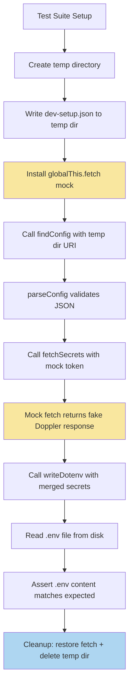
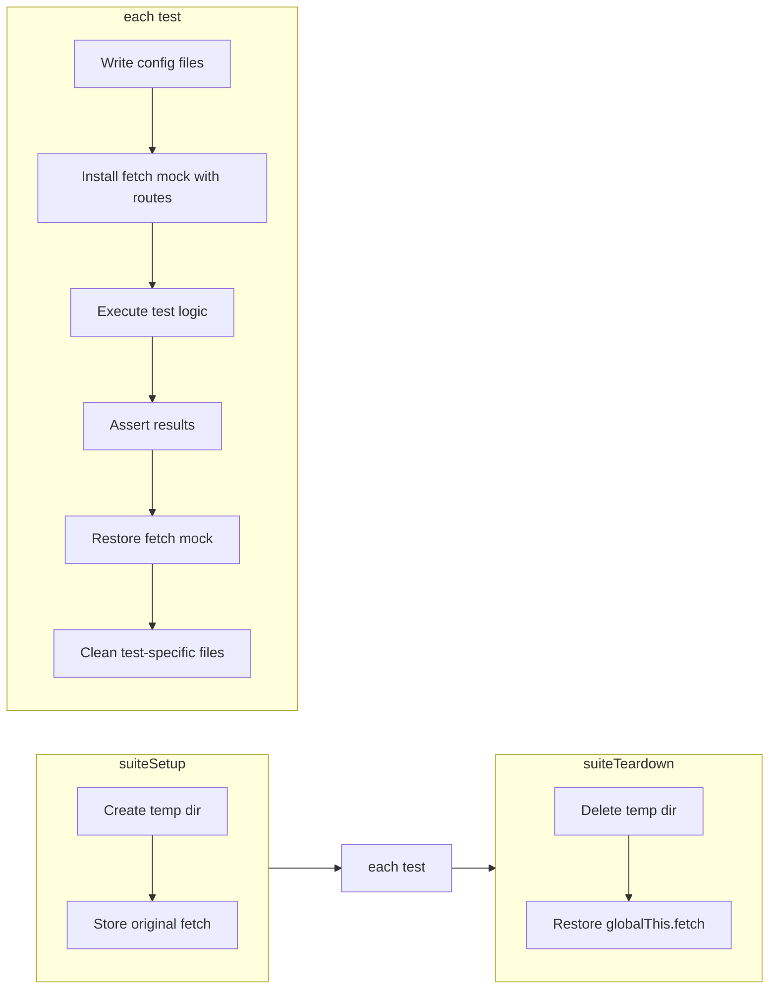

# Integration Test Design: `fetchSecrets` Workflow

## 1. Overview

This document describes the design for an integration test that validates the end-to-end `fetchSecrets` pipeline:

**config discovery → Doppler API call → `.env` file writing**

The test exercises real code paths through [`findConfig()`](src/config/configFinder.ts:11), [`parseConfig()`](src/config/configParser.ts:8), [`fetchSecrets()`](src/doppler/dopplerClient.ts:66), and [`writeDotenv()`](src/loaders/dotenvWriter.ts:8) — with only the network boundary and secret storage mocked.

---

## 2. Test Architecture

### 2.1 Two-Layer Strategy

The tests are split into two complementary layers:

| Layer | What it tests | Mocking level |
|-------|--------------|---------------|
| **Unit-integration** | Individual functions with controlled inputs | Minimal — only `globalThis.fetch` |
| **Pipeline-integration** | Full `processWorkspaceFolder` equivalent flow | `globalThis.fetch` + fake `SecretStorage` + temp filesystem |

The unit-integration layer calls exported functions directly (`parseConfig`, `fetchSecrets`, `writeDotenv`, `findConfig`) with crafted inputs. The pipeline-integration layer orchestrates the full sequence using a temporary workspace folder on disk.

### 2.2 Test Execution Environment

Tests run inside the VS Code Extension Host via `@vscode/test-electron`, so the real `vscode` API is available. This means:

- `vscode.workspace.fs` operates on the real filesystem
- `vscode.Uri` works as expected  
- No need to mock the VS Code API itself for filesystem operations

### 2.3 Architecture Diagram



---

## 3. Mocking Strategy

### 3.1 HTTP — `globalThis.fetch`

The production code in [`dopplerClient.ts`](src/doppler/dopplerClient.ts:71) uses the global `fetch()` function. We intercept it by replacing `globalThis.fetch` with a custom implementation.

**Mock implementation pattern:**

```typescript
let originalFetch: typeof globalThis.fetch;

function installFetchMock(responses: Map<string, MockResponse>): void {
    originalFetch = globalThis.fetch;
    globalThis.fetch = async (input: RequestInfo | URL, init?: RequestInit) => {
        const url = typeof input === 'string' ? input : input.toString();
        const match = responses.get(url);
        // ... return Response based on match
    };
}

function restoreFetch(): void {
    globalThis.fetch = originalFetch;
}
```

The mock stores every call it receives for later assertion — verifying the URL, query parameters, and `Authorization` header.

**Key assertion points on the fetch mock:**
- URL is `https://api.doppler.com/v3/configs/config/secrets`
- Query params include `project=<expected>` and `config=<expected-batch>`
- Authorization header is `Bearer <mock-token>`

### 3.2 SecretStorage — Fake Implementation

[`getStoredToken()`](src/doppler/dopplerClient.ts:51) accepts a `vscode.SecretStorage` parameter. We create a minimal fake that satisfies the interface:

```typescript
function createFakeSecretStorage(
    secrets: Record<string, string> = {},
): vscode.SecretStorage {
    const store = new Map<string, string>(Object.entries(secrets));
    return {
        get: async (key: string) => store.get(key),
        store: async (key: string, value: string) => { store.set(key, value); },
        delete: async (key: string) => { store.delete(key); },
        onDidChange: new vscode.EventEmitter<vscode.SecretStorageChangeEvent>().event,
    };
}
```

Pre-populated with `'dev-setup.dopplerToken': 'dp.test.mock_token_value'` for the happy path, and empty for the missing-token scenario.

### 3.3 Workspace Folder — Temp Directory with Real Files

Since [`findConfig()`](src/config/configFinder.ts:11) uses `vscode.workspace.fs.readFile()`, we create real files on disk in a temp directory. The `os.tmpdir()` + `crypto.randomUUID()` approach guarantees isolation between test runs.

The temp directory serves as a simulated workspace folder root. A `vscode.Uri.file(tempDir)` is passed directly to `findConfig()`.

### 3.4 OutputChannel — Stub

A minimal object that captures log lines for assertion:

```typescript
function createFakeOutputChannel(): vscode.OutputChannel & { lines: string[] } {
    const lines: string[] = [];
    return {
        lines,
        appendLine: (line: string) => { lines.push(line); },
        append: () => {},
        clear: () => {},
        show: () => {},
        hide: () => {},
        dispose: () => {},
        name: 'Test Output',
        replace: () => {},
    };
}
```

---

## 4. Test File Structure

```
src/test/
├── suite/
│   ├── extension.test.ts          # existing smoke tests
│   └── fetchSecrets.test.ts       # NEW — integration tests
└── helpers/
    ├── fetchMock.ts               # globalThis.fetch mock utilities
    ├── fakeSecretStorage.ts       # fake SecretStorage implementation
    ├── fakeOutputChannel.ts       # fake OutputChannel stub
    └── tempWorkspace.ts           # temp directory creation/cleanup + config writer
```

All helpers are plain TypeScript files with no external dependencies — consistent with the zero-runtime-dependency rule. They are only devDependencies on `@types/vscode` and `@types/node`.

### 4.1 Helper Descriptions

| Helper | Exports | Purpose |
|--------|---------|---------|
| [`fetchMock.ts`](src/test/helpers/fetchMock.ts) | `installFetchMock()`, `restoreFetch()`, `FetchCallRecord` | Intercepts `globalThis.fetch`, records calls, returns configured responses |
| [`fakeSecretStorage.ts`](src/test/helpers/fakeSecretStorage.ts) | `createFakeSecretStorage()` | In-memory `SecretStorage` implementation |
| [`fakeOutputChannel.ts`](src/test/helpers/fakeOutputChannel.ts) | `createFakeOutputChannel()` | Captures `appendLine` calls for log assertions |
| [`tempWorkspace.ts`](src/test/helpers/tempWorkspace.ts) | `createTempWorkspace()`, `cleanupTempWorkspace()`, `writeConfigFile()` | Creates temp dirs, writes `dev-setup.json`, cleans up after tests |

---

## 5. Test Scenarios

### 5.1 `parseConfig` Unit Tests

| # | Scenario | Input | Expected |
|---|----------|-------|----------|
| 1 | Valid config with all fields | Full `dev-setup.json` as `Uint8Array` | Returns `DevSetupConfig` with correct `secrets` fields |
| 2 | Config without `secrets` key | `{}` as JSON | Returns `DevSetupConfig` with `secrets: undefined` |
| 3 | Invalid JSON | `not json` | Throws with message containing `Failed to parse` |
| 4 | Missing required `provider` | `{ secrets: { loader: "dotenv", batches: ["dev"] } }` | Throws with message about `secrets.provider` |

### 5.2 `findConfig` Integration Tests

| # | Scenario | Setup | Expected |
|---|----------|-------|----------|
| 5 | Config in workspace root | `dev-setup.json` at temp root | Returns `ConfigLocation` with directory = temp root |
| 6 | Config in `dev/` subdirectory | `dev/dev-setup.json` in temp | Returns `ConfigLocation` with directory = temp/dev |
| 7 | No config file present | Empty temp directory | Returns `undefined` |
| 8 | Root takes precedence over `dev/` | Both locations have config | Returns root location |

### 5.3 `fetchSecrets` Unit Tests with Mocked Fetch

| # | Scenario | Mock Response | Expected |
|---|----------|---------------|----------|
| 9 | Successful response | `200` with secrets JSON | Returns `SecretMap` with `computed` values extracted |
| 10 | API error response | `401 Unauthorized` | Throws with `Doppler API error (401)` |
| 11 | Malformed response body | `200` with `{ "noSecrets": true }` | Throws about unexpected format |
| 12 | Correct request parameters | N/A — assert on recorded call | URL has correct project/config params; Authorization = `Bearer <token>` |

### 5.4 `writeDotenv` Integration Tests

| # | Scenario | Input | Expected `.env` content |
|---|----------|-------|------------------------|
| 13 | Simple key-value pairs | `{ DB_HOST: 'localhost', API_KEY: 'abc123' }` | `API_KEY=abc123\nDB_HOST=localhost\n` — sorted |
| 14 | Values needing quoting | `{ MSG: 'hello world', PATH: '/usr/bin' }` | `MSG="hello world"\nPATH=/usr/bin\n` |
| 15 | Empty value | `{ EMPTY: '' }` | `EMPTY=""\n` |
| 16 | Values with special chars | `{ DSN: 'pg://u:p@host/db#main' }` | Properly escaped with quotes |

### 5.5 End-to-End Pipeline Test

| # | Scenario | Description |
|---|----------|-------------|
| 17 | Happy path — single batch | Create temp dir with valid config → mock fetch returns secrets → verify `.env` written correctly |
| 18 | Happy path — multiple batches | Config with `batches: ["dev", "ci"]` → mock returns different secrets per batch → verify merged `.env` |
| 19 | Missing token | No token in fake `SecretStorage` → pipeline exits early, no `.env` created |
| 20 | Doppler API failure | Mock fetch returns 500 → error logged in output channel, no `.env` created |
| 21 | Config in `dev/` subfolder | Config placed in `dev/` → `.env` written adjacent to config in `dev/` directory |

---

## 6. Sample Pseudocode — Main Integration Test

```typescript
import * as assert from 'assert';
import * as vscode from 'vscode';
import * as os from 'os';
import * as path from 'path';
import { findConfig } from '../../config/configFinder';
import { fetchSecrets, getStoredToken } from '../../doppler/dopplerClient';
import { writeDotenv } from '../../loaders/dotenvWriter';
import { SecretMap } from '../../config/configTypes';
import { installFetchMock, restoreFetch } from '../helpers/fetchMock';
import { createTempWorkspace, cleanupTempWorkspace, writeConfigFile } from '../helpers/tempWorkspace';

suite('fetchSecrets Pipeline Integration', () => {
    let tempDir: string;

    suiteSetup(async () => {
        // Create isolated temp workspace
        tempDir = await createTempWorkspace();
    });

    suiteTeardown(async () => {
        restoreFetch();
        await cleanupTempWorkspace(tempDir);
    });

    test('End-to-end: config discovery → API fetch → .env write', async () => {
        // 1. Arrange — write dev-setup.json
        const config = {
            secrets: {
                provider: 'doppler',
                loader: 'dotenv',
                batches: ['dev'],
                project: 'test-project',
            },
        };
        await writeConfigFile(tempDir, config);

        // 2. Arrange — mock Doppler API response
        const mockSecrets = {
            secrets: {
                DATABASE_URL: { raw: 'pg://ref', computed: 'pg://localhost:5432/mydb' },
                API_KEY: { raw: '${ref}', computed: 'sk-test-12345' },
                APP_NAME: { raw: 'MyApp', computed: 'MyApp' },
            },
        };

        const fetchCalls = installFetchMock(new Map([
            [
                'https://api.doppler.com/v3/configs/config/secrets?project=test-project&config=dev',
                { status: 200, body: JSON.stringify(mockSecrets) },
            ],
        ]));

        // 3. Act — run the pipeline steps individually
        const workspaceUri = vscode.Uri.file(tempDir);

        // Step A: Find and parse config
        const location = await findConfig(workspaceUri);
        assert.ok(location, 'Config should be found');
        assert.strictEqual(location.config.secrets?.project, 'test-project');

        // Step B: Fetch secrets (with mocked fetch)
        const token = 'dp.test.mock_token';
        const secrets = await fetchSecrets(token, 'test-project', 'dev');

        // Verify fetch was called correctly
        assert.strictEqual(fetchCalls.length, 1, 'fetch should be called once');
        assert.ok(
            fetchCalls[0].url.includes('project=test-project'),
            'URL should contain project param',
        );
        assert.strictEqual(
            fetchCalls[0].headers?.['Authorization'],
            'Bearer dp.test.mock_token',
        );

        // Step C: Verify extracted secrets
        assert.deepStrictEqual(secrets, {
            DATABASE_URL: 'pg://localhost:5432/mydb',
            API_KEY: 'sk-test-12345',
            APP_NAME: 'MyApp',
        });

        // Step D: Write .env
        const envPath = await writeDotenv(location.directory, secrets);

        // Step E: Read back and verify .env content
        const envUri = vscode.Uri.file(envPath);
        const envContent = new TextDecoder().decode(
            await vscode.workspace.fs.readFile(envUri),
        );

        const expectedEnv = [
            'API_KEY=sk-test-12345',
            'APP_NAME=MyApp',
            'DATABASE_URL=pg://localhost:5432/mydb',
            '',  // trailing newline
        ].join('\n');

        assert.strictEqual(envContent, expectedEnv);
    });
});
```

---

## 7. Fetch Mock Implementation Detail

The fetch mock needs to handle URL matching carefully because [`fetchSecrets()`](src/doppler/dopplerClient.ts:67) constructs the URL with `new URL()` and appends search params. The mock should match by URL prefix or parse query parameters rather than requiring exact string equality, since param order is not guaranteed.

```typescript
export interface FetchCallRecord {
    url: string;
    method: string;
    headers: Record<string, string>;
}

export interface MockResponse {
    status: number;
    body: string;
    headers?: Record<string, string>;
}

export function installFetchMock(
    routes: Map<string, MockResponse>,
): FetchCallRecord[] {
    const calls: FetchCallRecord[] = [];
    const original = globalThis.fetch;

    globalThis.fetch = async (
        input: RequestInfo | URL,
        init?: RequestInit,
    ): Promise<Response> => {
        const url = typeof input === 'string'
            ? input
            : input instanceof URL
                ? input.toString()
                : input.url;

        const headers: Record<string, string> = {};
        if (init?.headers) {
            const h = init.headers as Record<string, string>;
            for (const [k, v] of Object.entries(h)) {
                headers[k] = v;
            }
        }

        calls.push({ url, method: init?.method ?? 'GET', headers });

        // Match by checking if any route key is a prefix of the URL
        // or if the URL starts with the route key
        for (const [routeUrl, response] of routes) {
            if (url === routeUrl || url.startsWith(routeUrl.split('?')[0])) {
                return new Response(response.body, {
                    status: response.status,
                    headers: response.headers ?? { 'Content-Type': 'application/json' },
                });
            }
        }

        // Fallback: unexpected call
        throw new Error(`Unexpected fetch call: ${url}`);
    };

    // Store original for restoration
    (globalThis as any).__originalFetch = original;

    return calls;
}

export function restoreFetch(): void {
    const original = (globalThis as any).__originalFetch;
    if (original) {
        globalThis.fetch = original;
        delete (globalThis as any).__originalFetch;
    }
}
```

---

## 8. Temp Workspace Helper Detail

```typescript
import * as os from 'os';
import * as path from 'path';
import * as crypto from 'crypto';
import * as vscode from 'vscode';

export async function createTempWorkspace(): Promise<string> {
    const id = crypto.randomUUID();
    const dir = path.join(os.tmpdir(), `vscode-dev-setup-test-${id}`);
    const uri = vscode.Uri.file(dir);
    await vscode.workspace.fs.createDirectory(uri);
    return dir;
}

export async function writeConfigFile(
    baseDir: string,
    config: object,
    subdir?: string,
): Promise<void> {
    const targetDir = subdir
        ? path.join(baseDir, subdir)
        : baseDir;
    const dirUri = vscode.Uri.file(targetDir);
    await vscode.workspace.fs.createDirectory(dirUri);

    const fileUri = vscode.Uri.joinPath(dirUri, 'dev-setup.json');
    const content = new TextEncoder().encode(JSON.stringify(config, null, 2));
    await vscode.workspace.fs.writeFile(fileUri, content);
}

export async function cleanupTempWorkspace(dir: string): Promise<void> {
    const uri = vscode.Uri.file(dir);
    await vscode.workspace.fs.delete(uri, { recursive: true });
}
```

---

## 9. Dependencies

**No new runtime dependencies required.**

No new devDependencies are strictly needed either. The test design uses:

| Capability | Source | Already available? |
|-----------|--------|-------------------|
| Assertions | `node:assert` | Yes — built-in |
| Temp directories | `node:os` + `node:crypto` | Yes — built-in |
| Fetch mock | Manual `globalThis.fetch` replacement | N/A — custom code |
| SecretStorage fake | Manual interface implementation | N/A — custom code |
| Test runner | `@vscode/test-cli` + Mocha TDD | Yes — in devDependencies |

**Optional consideration:** If tests grow more complex in the future, adding [`sinon`](https://www.npmjs.com/package/sinon) as a devDependency would simplify stubbing, but it is not required for this initial design.

---

## 10. Test Lifecycle and Isolation



**Isolation guarantees:**

1. Each test creates its own config file content — preventing cross-test contamination
2. `globalThis.fetch` is saved/restored around each test via `setup()`/`teardown()` hooks
3. The entire temp directory is deleted in `suiteTeardown`
4. Tests are independent — no shared mutable state between scenarios

---

## 11. Risks and Mitigations

| Risk | Impact | Mitigation |
|------|--------|------------|
| `globalThis.fetch` not restored after test failure | Subsequent tests fail or make real HTTP calls | Use `teardown()` hook which runs even on test failure |
| Temp files left behind on crash | Disk clutter | Use OS temp dir — cleaned by OS eventually; optionally add a cleanup-on-startup guard |
| URL param order differs across platforms | Fetch mock misses match | Match by base URL + parse query params separately rather than exact string match |
| `vscode.workspace.fs` behaves differently in test host | File operations fail | Already verified: `@vscode/test-electron` provides the real VS Code API and filesystem |
| Tests coupled to internal implementation details | Fragile tests break on refactor | Test at the public API boundary — focus on inputs and outputs, not internal call order |

---

## 12. Summary

This design provides comprehensive coverage of the `fetchSecrets` pipeline without introducing any new dependencies. The key decisions are:

1. **Manual `globalThis.fetch` mock** — lightweight, zero-dependency, full control over request assertions
2. **Fake `SecretStorage`** — simple `Map`-backed implementation satisfying the `vscode.SecretStorage` interface
3. **Real filesystem via temp dirs** — exercises `vscode.workspace.fs` as used in production
4. **Two-layer approach** — unit-integration tests for individual functions + pipeline tests for the full flow
5. **21 test scenarios** covering happy paths, error handling, edge cases, and config discovery locations
