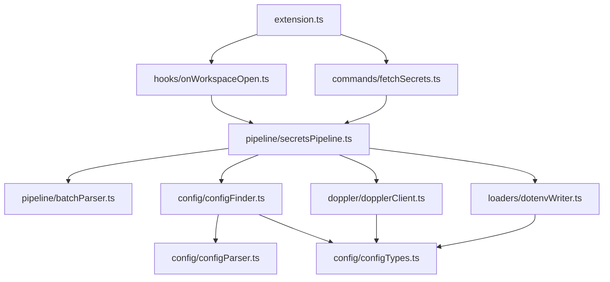
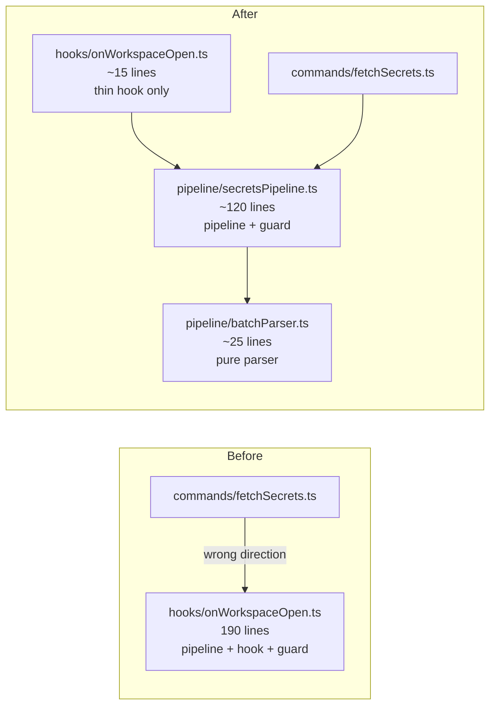

# Refactoring Plan: Extract Secrets Pipeline & Batch Name Slash Parsing

## 1. Overview

This refactoring addresses two concerns:

1. **Extract the fetch-secrets pipeline** from [`src/hooks/onWorkspaceOpen.ts`](src/hooks/onWorkspaceOpen.ts) into a dedicated, reusable module so that both the workspace-open hook and the manual command import from a single source of truth.
2. **Add batch name slash parsing** so that individual batch entries in the `batches` array can override the Doppler project on a per-batch basis using a `project/config` syntax.

---

## 2. New File Structure

### Files Created

| File | Purpose |
|------|---------|
| `src/pipeline/secretsPipeline.ts` | Reusable pipeline: [`fetchSecretsFromConfig()`](src/hooks/onWorkspaceOpen.ts:38), [`processWorkspaceFolder()`](src/hooks/onWorkspaceOpen.ts:88), [`resetConcurrencyGuard()`](src/hooks/onWorkspaceOpen.ts:12), concurrency guard state |
| `src/pipeline/batchParser.ts` | Pure helper: [`parseBatchEntry()`](#3-the-parsebatchentry-function) |
| `src/test/suite/batchParser.test.ts` | Unit tests for `parseBatchEntry()` |

### Files Modified

| File | Change |
|------|--------|
| [`src/hooks/onWorkspaceOpen.ts`](src/hooks/onWorkspaceOpen.ts) | Gut to a thin wrapper that re-exports from pipeline and calls it |
| [`src/commands/fetchSecrets.ts`](src/commands/fetchSecrets.ts) | Change import from `../hooks/onWorkspaceOpen` → `../pipeline/secretsPipeline` |
| [`src/test/suite/fetchSecrets.test.ts`](src/test/suite/fetchSecrets.test.ts) | Change imports from `../../hooks/onWorkspaceOpen` → `../../pipeline/secretsPipeline` |

### Files Unchanged

| File | Reason |
|------|--------|
| [`src/extension.ts`](src/extension.ts) | Still imports [`onWorkspaceOpen`](src/extension.ts:4) from hooks — no change needed |
| [`src/config/configTypes.ts`](src/config/configTypes.ts) | No structural changes required |
| [`src/config/configFinder.ts`](src/config/configFinder.ts) | No changes |
| [`src/config/configParser.ts`](src/config/configParser.ts) | No changes |
| [`src/doppler/dopplerClient.ts`](src/doppler/dopplerClient.ts) | No changes — still receives `project` and `config` as separate parameters |
| [`src/loaders/dotenvWriter.ts`](src/loaders/dotenvWriter.ts) | No changes |

---

## 3. Module Responsibilities

### `src/pipeline/batchParser.ts`

**Purpose:** Pure parsing logic for batch entry strings. No VS Code dependencies.

**Exports:**

```typescript
export interface ParsedBatchEntry {
    project: string;
    config: string;
}

export function parseBatchEntry(batchEntry: string, defaultProject: string): ParsedBatchEntry;
```

**No other exports.** This module is intentionally minimal and pure — no side effects, no I/O, no vscode imports.

---

### `src/pipeline/secretsPipeline.ts`

**Purpose:** The complete fetch-secrets orchestration pipeline, extracted from [`onWorkspaceOpen.ts`](src/hooks/onWorkspaceOpen.ts).

**Exports:**

```typescript
export function resetConcurrencyGuard(): void;

export async function fetchSecretsFromConfig(
    context: vscode.ExtensionContext,
    outputChannel: vscode.OutputChannel,
    manual?: boolean,
): Promise<void>;

export async function processWorkspaceFolder(
    folder: vscode.WorkspaceFolder,
    context: vscode.ExtensionContext,
    outputChannel: vscode.OutputChannel,
    manual: boolean,
): Promise<void>;
```

**Internal state:** The `activeFetch` concurrency guard variable lives in this module as a module-level `let`.

**Key change in `processWorkspaceFolder()`:** The batch iteration loop (step 7, currently at [line 152](src/hooks/onWorkspaceOpen.ts:152)) will use `parseBatchEntry()` to resolve per-batch project names instead of using a single `project` variable for all batches.

---

### `src/hooks/onWorkspaceOpen.ts` (slimmed down)

**Purpose:** Thin hook that the extension activation calls. Delegates entirely to the pipeline.

**Exports:**

```typescript
export async function onWorkspaceOpen(
    context: vscode.ExtensionContext,
    outputChannel: vscode.OutputChannel,
): Promise<void>;
```

**No longer exports** `fetchSecretsFromConfig`, `processWorkspaceFolder`, or `resetConcurrencyGuard`. Those move to `secretsPipeline.ts`.

---

### `src/commands/fetchSecrets.ts` (updated import)

**Change:** Import path updates from:

```typescript
import { fetchSecretsFromConfig } from '../hooks/onWorkspaceOpen';
```

to:

```typescript
import { fetchSecretsFromConfig } from '../pipeline/secretsPipeline';
```

No other changes to this file.

---

## 4. The `parseBatchEntry` Function

### Signature

```typescript
/**
 * Parse a batch entry string into a project name and config name.
 * If the entry contains a `/`, the part before the slash is the project
 * and the part after is the config. Otherwise, the defaultProject is used.
 *
 * @param batchEntry — a single entry from the `batches` array
 * @param defaultProject — fallback project when no slash is present
 * @returns parsed project and config names
 */
export function parseBatchEntry(batchEntry: string, defaultProject: string): ParsedBatchEntry;
```

### Behavior

| Input `batchEntry` | `defaultProject` | Result `project` | Result `config` |
|---------------------|-------------------|-------------------|------------------|
| `'dev'` | `'my-app'` | `'my-app'` | `'dev'` |
| `'staging'` | `'my-app'` | `'my-app'` | `'staging'` |
| `'shared-lib/dev'` | `'my-app'` | `'shared-lib'` | `'dev'` |
| `'other-project/prod'` | `'my-app'` | `'other-project'` | `'prod'` |
| `'a/b/c'` | `'my-app'` | `'a'` | `'b/c'` |

### Rules

1. **No slash** → `{ project: defaultProject, config: batchEntry }`
2. **One slash** → split on first `/` only; `{ project: left, config: right }`
3. **Multiple slashes** → split on first `/` only; everything after the first slash is the config name (Doppler config names may contain slashes in certain setups)

### Implementation Sketch

```typescript
export function parseBatchEntry(batchEntry: string, defaultProject: string): ParsedBatchEntry {
    const slashIndex = batchEntry.indexOf('/');
    if (slashIndex === -1) {
        return { project: defaultProject, config: batchEntry };
    }
    return {
        project: batchEntry.substring(0, slashIndex),
        config: batchEntry.substring(slashIndex + 1),
    };
}
```

### Integration Point

In [`processWorkspaceFolder()`](src/hooks/onWorkspaceOpen.ts:88), the current batch loop at [line 152](src/hooks/onWorkspaceOpen.ts:152):

```typescript
// Current code
const project = configProject || folder.name;
for (const batchName of batches) {
    const batchSecrets = await fetchSecrets(token, project, batchName, outputChannel);
    // ...
}
```

becomes:

```typescript
// New code
const defaultProject = configProject || folder.name;
for (const batchName of batches) {
    const { project, config } = parseBatchEntry(batchName, defaultProject);
    outputChannel.appendLine(
        `Dev Setup: Fetching batch "${config}" for project "${project}"`,
    );
    const batchSecrets = await fetchSecrets(token, project, config, outputChannel);
    // ...
}
```

---

## 5. Migration Plan

The steps below should be executed in order. Each step results in a compilable, testable state.

### Step 1 — Create `src/pipeline/batchParser.ts`

- Create the new file with the `ParsedBatchEntry` interface and `parseBatchEntry()` function
- Pure module, no dependencies on vscode or other project modules
- Add JSDoc comments per coding standards

### Step 2 — Create `src/test/suite/batchParser.test.ts`

- Unit tests covering all cases from the behavior table above
- Edge cases: empty string before slash, empty string after slash, multiple slashes
- These tests exercise only the pure function — no mocking needed

### Step 3 — Create `src/pipeline/secretsPipeline.ts`

- Move [`fetchSecretsFromConfig()`](src/hooks/onWorkspaceOpen.ts:38), [`processWorkspaceFolder()`](src/hooks/onWorkspaceOpen.ts:88), [`resetConcurrencyGuard()`](src/hooks/onWorkspaceOpen.ts:12), and the `activeFetch` guard variable from [`onWorkspaceOpen.ts`](src/hooks/onWorkspaceOpen.ts) into this new file
- Update `processWorkspaceFolder()` to use `parseBatchEntry()` in the batch loop
- Update the log message at [line 188](src/hooks/onWorkspaceOpen.ts:188) to reflect that per-batch projects are now possible (it currently logs a single project name)
- Carry over all existing imports: [`findConfig`](src/config/configFinder.ts:44), [`SecretMap`](src/config/configTypes.ts:18), [`fetchSecrets`](src/doppler/dopplerClient.ts:81), [`getStoredToken`](src/doppler/dopplerClient.ts:66), [`writeDotenv`](src/loaders/dotenvWriter.ts:8)

### Step 4 — Slim down `src/hooks/onWorkspaceOpen.ts`

- Remove all pipeline logic
- Keep only the `onWorkspaceOpen()` function
- Import `fetchSecretsFromConfig` from `../pipeline/secretsPipeline`
- The file becomes ~15 lines

### Step 5 — Update `src/commands/fetchSecrets.ts`

- Change import path from `'../hooks/onWorkspaceOpen'` to `'../pipeline/secretsPipeline'`
- No other changes needed

### Step 6 — Update `src/test/suite/fetchSecrets.test.ts`

- Change import of `processWorkspaceFolder`, `fetchSecretsFromConfig`, `resetConcurrencyGuard` from `'../../hooks/onWorkspaceOpen'` to `'../../pipeline/secretsPipeline'`
- No test logic changes needed for existing tests — they should pass as-is
- Optionally add new test cases for slash-based batch entries

### Step 7 — Verify

- `npm run compile` passes
- `npm test` passes
- Manual smoke test: extension activates, secrets fetch works with and without slash syntax

---

## 6. Impact on Tests

### `src/test/suite/fetchSecrets.test.ts`

| Area | Impact |
|------|--------|
| **Imports** | Update the import path for `processWorkspaceFolder`, `fetchSecretsFromConfig`, `resetConcurrencyGuard` from `../../hooks/onWorkspaceOpen` → `../../pipeline/secretsPipeline` |
| **Existing test cases** | No logic changes. All 15+ existing tests should pass identically since the function signatures are unchanged |
| **New test cases to add** | Tests for batch entries with slashes: verify that `processWorkspaceFolder()` calls [`fetchSecrets()`](src/doppler/dopplerClient.ts:81) with the correct per-batch project. Use `fetchMock` to assert the `project=` query parameter matches the project parsed from the slash syntax |

### `src/test/suite/batchParser.test.ts` (new file)

Pure unit tests — no VS Code test infrastructure needed, but will run as part of the existing test suite. Test cases:

1. Simple batch name with no slash returns `defaultProject`
2. Batch name with single slash splits correctly
3. Batch name with multiple slashes splits on first slash only
4. Various `defaultProject` values are passed through correctly
5. Edge case: slash at the start — empty project string, full config
6. Edge case: slash at the end — project string, empty config

### Test helpers

No changes needed to any test helper files:
- [`fakeOutputChannel.ts`](src/test/helpers/fakeOutputChannel.ts) — unchanged
- [`fakeSecretStorage.ts`](src/test/helpers/fakeSecretStorage.ts) — unchanged
- [`fetchMock.ts`](src/test/helpers/fetchMock.ts) — unchanged
- [`tempWorkspace.ts`](src/test/helpers/tempWorkspace.ts) — unchanged

---

## 7. Dependency Graph



### Before vs After



---

## 8. Config Example with Slash Syntax

```yaml
# dev-setup.yaml
secrets:
  provider: doppler
  loader: dotenv
  project: my-app           # default project for batches without a slash
  batches:
    - dev                    # → project: my-app, config: dev
    - staging                # → project: my-app, config: staging
    - shared-lib/dev         # → project: shared-lib, config: dev
    - auth-service/prod      # → project: auth-service, config: prod
```

This allows a single workspace to pull secrets from multiple Doppler projects in one pipeline run while maintaining backward compatibility with the existing no-slash format.
