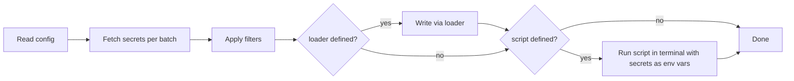
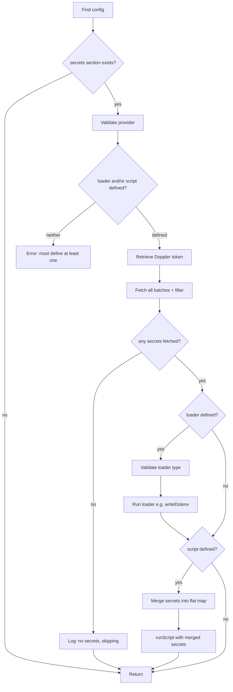

# Script Runner — Architecture Design

## 1. Overview

This document describes the design for adding **post-fetch script execution** to the Dev Setup VS Code extension. After secrets are fetched from Doppler and optionally written via a loader, a user-configured shell command can be executed in a new VS Code terminal with all fetched secrets injected as environment variables.

### Current Flow


### Proposed Flow



---

## 2. Updated Type Definitions

File: [`configTypes.ts`](../src/config/configTypes.ts)

### Changes

- Make `loader` optional on [`SecretsConfig`](../src/config/configTypes.ts:9)
- Add optional `script` field to [`SecretsConfig`](../src/config/configTypes.ts:9)

### Proposed Interface

```typescript
export interface SecretsConfig {
    provider: string;
    loader?: string;       // was required, now optional
    script?: string;       // NEW — shell command to run after fetch
    batches: string[];
    project?: string;
    filter?: SecretFilter;
}
```

### Validation Matrix

| `loader` | `script` | Valid? | Behavior |
|----------|----------|--------|----------|
| set      | set      | ✅     | Run loader, then run script |
| set      | unset    | ✅     | Run loader only - current behavior |
| unset    | set      | ✅     | Skip loader, run script only |
| unset    | unset    | ❌     | Validation error — at least one must be defined |

---

## 3. Validation Changes

File: [`configParser.ts`](../src/config/configParser.ts)

### Current Behavior

[`validateConfig()`](../src/config/configParser.ts:9) currently requires `secrets.loader` to be a non-empty string (line 24-26). This must change.

### Required Changes

1. **Remove the unconditional `loader` check** — `loader` is no longer required.

2. **Add conditional validation** — if `loader` is present, it must be a non-empty string. If `script` is present, it must be a non-empty string.

3. **Add mutual-existence check** — at least one of `loader` or `script` must be defined. If neither is present, throw:
   ```
   Invalid dev-setup config: 'secrets' must define at least one of 'loader' or 'script'
   ```

4. **Update logging** — the log line at [line 86](../src/config/configParser.ts:86) currently always logs `loader`. Update to conditionally log `loader` and/or `script`.

### Pseudocode

```typescript
// Inside validateConfig(), replace the loader check:

if (sec.loader !== undefined) {
    if (typeof sec.loader !== 'string' || sec.loader.length === 0) {
        throw new Error(
            "Invalid dev-setup config: 'secrets.loader' must be a non-empty string if provided",
        );
    }
}

if (sec.script !== undefined) {
    if (typeof sec.script !== 'string' || sec.script.length === 0) {
        throw new Error(
            "Invalid dev-setup config: 'secrets.script' must be a non-empty string if provided",
        );
    }
}

if (sec.loader === undefined && sec.script === undefined) {
    throw new Error(
        "Invalid dev-setup config: 'secrets' must define at least one of 'loader' or 'script'",
    );
}
```

---

## 4. Script Runner Module

New file: `src/runners/scriptRunner.ts`

### Responsibilities

- Create a VS Code terminal with fetched secrets injected as environment variables
- Execute the configured script command in that terminal
- Set the working directory to the config file's directory

### Public API

```typescript
/**
 * Execute a shell script in a new VS Code terminal with secrets
 * injected as environment variables.
 *
 * @param script - The shell command string to execute
 * @param secrets - Merged and deduplicated secret key-value pairs
 * @param configDir - Absolute path to the config file's directory, used as cwd
 * @param outputChannel - Output channel for logging
 */
export async function runScript(
    script: string,
    secrets: SecretMap,
    configDir: string,
    outputChannel: vscode.OutputChannel,
): Promise<void>;
```

### Implementation Details

#### Terminal Creation

Use the [`vscode.window.createTerminal()`](https://code.visualstudio.com/api/references/vscode-api#window.createTerminal) API with `TerminalOptions`:

```typescript
const terminal = vscode.window.createTerminal({
    name: `Dev Setup: ${script}`,
    cwd: configDir,
    env: secrets,
});
```

- **`name`**: `Dev Setup: {script}` — truncated to a reasonable length if the command is long (e.g., first 50 characters)
- **`cwd`**: set to `configDir` so relative paths in the script resolve correctly
- **`env`**: the full [`SecretMap`](../src/config/configTypes.ts:28) — VS Code merges these with the existing process environment

#### Script Execution

After terminal creation, send the command text:

```typescript
terminal.show(false); // show terminal without taking focus
terminal.sendText(script);
```

#### Terminal Name Truncation

To keep terminal tab labels readable:

```typescript
const MAX_TERMINAL_NAME_LENGTH = 50;
const displayName = script.length > MAX_TERMINAL_NAME_LENGTH
    ? `${script.substring(0, MAX_TERMINAL_NAME_LENGTH)}...`
    : script;
const terminalName = `Dev Setup: ${displayName}`;
```

#### Secret Merging for Script Runner

The script runner receives a flat [`SecretMap`](../src/config/configTypes.ts:28) — the pipeline must merge all batched results into a single map before calling `runScript()`. First-writer-wins deduplication is used, consistent with [`dotenvWriter.ts`](../src/loaders/dotenvWriter.ts):

```typescript
function mergeBatchedSecrets(batchedResults: BatchedSecretEntry[]): SecretMap {
    const merged: SecretMap = {};
    for (const { secrets } of batchedResults) {
        for (const [key, value] of Object.entries(secrets)) {
            if (!(key in merged)) {
                merged[key] = value;
            }
        }
    }
    return merged;
}
```

This helper should be placed in [`secretsPipeline.ts`](../src/pipeline/secretsPipeline.ts) as an unexported helper, since it is already the module responsible for orchestrating the pipeline and deduplication logic.

---

## 5. Pipeline Integration

File: [`secretsPipeline.ts`](../src/pipeline/secretsPipeline.ts)

### Changes to [`processWorkspaceFolder()`](../src/pipeline/secretsPipeline.ts:114)

The function currently has a hardcoded flow: validate loader → fetch → write dotenv. This needs to be restructured to support the optional loader + optional script pattern.

#### Updated Flow



#### Specific Code Changes

1. **Destructure `script`** from `config.secrets` alongside existing fields (line 140):

   ```typescript
   const { provider, loader, script, batches, project: configProject } = config.secrets;
   ```

2. **Replace the unconditional loader validation** (lines 151-155) with conditional logic:

   ```typescript
   if (loader) {
       if (loader !== 'dotenv') {
           outputChannel.appendLine(
               `Unsupported secrets loader: ${loader}. Only 'dotenv' is supported.`,
           );
           return;
       }
   }
   ```

3. **Conditional loader execution** — wrap the dotenv write (lines 235-242) in an `if (loader)` guard:

   ```typescript
   if (loader) {
       try {
           await writeDotenv(configDir, batchedResults, outputChannel);
       } catch (error: unknown) {
           const message = error instanceof Error ? error.message : String(error);
           outputChannel.appendLine(`[Error] Failed to write .env file: ${message}`);
           if (manual) {
               vscode.window.showErrorMessage(`Dev Setup: Failed to write .env file — ${message}`);
           }
           return;
       }
   }
   ```

4. **Add script execution** after the loader block:

   ```typescript
   if (script) {
       try {
           const mergedSecrets = mergeBatchedSecrets(batchedResults);
           await runScript(script, mergedSecrets, configDir, outputChannel);
           outputChannel.appendLine(`Dev Setup: Script started in terminal: "${script}"`);
       } catch (error: unknown) {
           const message = error instanceof Error ? error.message : String(error);
           outputChannel.appendLine(`[Error] Failed to run script: ${message}`);
           if (manual) {
               vscode.window.showErrorMessage(`Dev Setup: Failed to run script — ${message}`);
           }
           return;
       }
   }
   ```

5. **Update the success message** (lines 244-252) to reflect what actions were taken:

   ```typescript
   const actions: string[] = [];
   if (loader) { actions.push(`.env file written to ${configDir}`); }
   if (script) { actions.push(`script started: "${script}"`); }

   outputChannel.appendLine(
       `Secrets loaded successfully from Doppler for project '${defaultProject}': ${actions.join(', ')}`,
   );

   if (manual) {
       vscode.window.showInformationMessage(
           `Dev Setup: Secrets loaded for '${defaultProject}' — ${actions.join(', ')}`,
       );
   }
   ```

### New Import

```typescript
import { runScript } from '../runners/scriptRunner';
```

---

## 6. Error Handling Matrix

All error messages use the `Dev Setup:` prefix per [`AGENTS.md`](../AGENTS.md) conventions.

| Error Scenario | `manual=true` | `manual=false` |
|---|---|---|
| No workspace folder open | `showWarningMessage` | Silent return |
| No config file found | `showWarningMessage` | Log to output channel |
| Neither `loader` nor `script` defined | Caught at config parse time — `showErrorMessage` | Caught at config parse time — log only |
| Unsupported loader value | `showErrorMessage` | Log to output channel |
| Doppler token missing | `showInformationMessage` | Log to output channel |
| Batch fetch failure | `showErrorMessage` | `showErrorMessage` — existing behavior |
| Loader write failure | `showErrorMessage` | Log to output channel |
| **Script execution failure** | `showErrorMessage` | Log to output channel |
| No secrets fetched - 0 keys | Log to output channel | Log to output channel |

### Note on Existing Bug

The current code at [line 93](../src/pipeline/secretsPipeline.ts:93) in [`processWorkspaceFolder()`](../src/pipeline/secretsPipeline.ts:114) always calls `showErrorMessage` regardless of the `manual` flag. The error handling for batch fetch failures (lines 212-216) also always shows a notification. These should be updated to respect the `manual` flag as part of this feature work, but that is a separate concern and can be addressed in a follow-up.

---

## 7. File Structure

```
src/
├── config/
│   ├── configTypes.ts       # Updated: loader optional, add script
│   ├── configParser.ts      # Updated: new validation logic
│   └── configFinder.ts      # No changes
├── runners/
│   └── scriptRunner.ts      # NEW: script execution module
├── loaders/
│   └── dotenvWriter.ts      # No changes
├── pipeline/
│   ├── secretsPipeline.ts   # Updated: conditional loader/script flow
│   └── batchParser.ts       # No changes
├── commands/
│   └── fetchSecrets.ts      # No changes
├── hooks/
│   └── onWorkspaceOpen.ts   # No changes
└── extension.ts             # No changes
```

---

## 8. Example Configurations

### Loader only — current behavior, unchanged

```yaml
secrets:
  provider: doppler
  loader: dotenv
  batches:
    - dev
```

### Script only — no .env file, secrets as env vars in terminal

```yaml
secrets:
  provider: doppler
  script: npm run start:dev
  batches:
    - dev
```

### Loader + Script — write .env, then run script with secrets in terminal

```yaml
secrets:
  provider: doppler
  loader: dotenv
  script: docker compose up
  batches:
    - dev
    - shared-services:staging
```

### With project override and filter

```yaml
secrets:
  provider: doppler
  loader: dotenv
  script: ./scripts/setup-local.sh
  project: my-api
  batches:
    - dev
    - staging
  filter:
    include:
      - ^DB_
      - ^REDIS_
    exclude:
      - _INTERNAL$
```

### Invalid — neither loader nor script

```yaml
# This will produce a validation error:
# "Invalid dev-setup config: 'secrets' must define at least one of 'loader' or 'script'"
secrets:
  provider: doppler
  batches:
    - dev
```

---

## 9. Testing Considerations

### Unit Tests for `scriptRunner.ts`

- Verify terminal is created with the correct `name`, `cwd`, and `env` options
- Verify `terminal.show()` and `terminal.sendText()` are called with correct arguments
- Verify terminal name truncation for long script commands
- Mock `vscode.window.createTerminal()` — return a fake terminal object

### Unit Tests for `configParser.ts` Changes

- Valid: `loader` only → passes
- Valid: `script` only → passes
- Valid: both `loader` and `script` → passes
- Invalid: neither `loader` nor `script` → throws expected error
- Invalid: `script` is empty string → throws expected error
- Invalid: `script` is non-string → throws expected error
- Valid: `loader` absent, `script` present → `loader` is `undefined` on result

### Integration Tests for `secretsPipeline.ts` Changes

- **Loader-only path**: secrets written to `.env`, no terminal created
- **Script-only path**: no `.env` written, terminal created with merged secrets
- **Loader + script path**: `.env` written first, then terminal created
- **Script receives merged and filtered secrets**: verify env var map is correct
- **Script error handling**: verify error is surfaced via `showErrorMessage` when `manual=true` and logged only when `manual=false`

### `mergeBatchedSecrets()` Helper

- Empty input → empty map
- Single batch → all keys present
- Multiple batches, no overlap → all keys present
- Multiple batches, overlapping keys → first-writer-wins

---

## 10. Implementation Checklist

1. Update [`SecretsConfig`](../src/config/configTypes.ts:9) — make `loader` optional, add `script` field
2. Update [`validateConfig()`](../src/config/configParser.ts:9) — new validation rules for `loader`/`script`
3. Update validation logging in [`validateConfig()`](../src/config/configParser.ts:83) to handle optional `loader`
4. Create `src/runners/scriptRunner.ts` with [`runScript()`](#4-script-runner-module) function
5. Add `mergeBatchedSecrets()` helper to [`secretsPipeline.ts`](../src/pipeline/secretsPipeline.ts)
6. Refactor [`processWorkspaceFolder()`](../src/pipeline/secretsPipeline.ts:114) — conditional loader/script execution
7. Update error handling to respect `manual` flag consistently
8. Update success messages to reflect which actions were performed
9. Add unit tests for `scriptRunner.ts`
10. Add unit tests for updated `configParser.ts` validation
11. Add integration tests for updated pipeline flow
